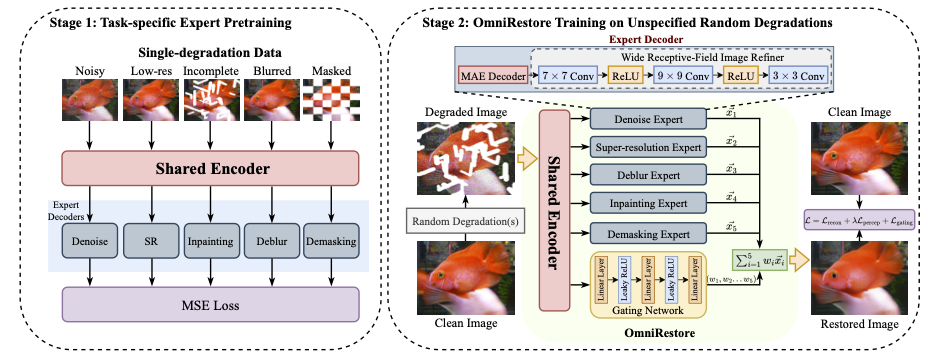

**OmniRestore: Robust Universal Image Restoration from Combined and Unspecified Degradations**

  

## Abstract

Conventional image restoration methods often implicitly assume that the degradation type in the input image is "seen" and "known" to the model, meaning it is trained and tested on the same type of degradation. More recent "all-in-one" models are designed to handle only one single degradation type in an image at a time, though the type can vary within a small, predefined set. This paper proposes **OmniRestore**, a novel approach to tackle a new and challenging task: "Omni Restoration", meaning restoring images with random, combined degradations of unspecified numbers and types. In this task, the restoration model must be able to restore images corrupted by multiple degradation types simultaneously, without prior knowledge of the exact types and the number of degradations in the input image. To address this, we devise a Mixture-of-Experts (MoE) architecture with a shared encoder and a group of type-sensitive decoder experts, alongside a two-stage training pipeline to expand the generalizability to various degradation types and their combinations. Extensive experiments demonstrate that our OmniRestore model consistently and significantly outperforms all state-of-the-art (SOTA) single-degradation models, vertical ensembles of those models, and "all-in-one" models on the Omni Restoration task. Our model also surpasses most of the competing models under a single-degradation setting with seen or unseen degradations.

For setting up the environment

pip install -r requirements.txt

Train the baseline module

Combined training with shared-encoder and five decoders 

python -m torch.distributed.launch --nproc_per_node node_vlaue pretrain_baseline.py --train_data_path path --val_data_path path --log_dir path   --output_dir path  --decoder_depth depthvalue --log_dir path

For using multigpus include --nproc_per_node=num_gpus, change the num_gpus as per the requirement

For running the aggregator module  use

python -m torch.distributed.launch --nproc_per_node num_gpus --master_port8871 pretrain_moe.py --output_dir path --log_dir path --train_dir path --val_dir path

## Code Structure

DeepLearningProject/
│
├── datasets/                # Datasets for training and testing
│   ├── raw/                 # Raw datasets (unprocessed)
│   └── processed/           # Preprocessed datasets (e.g., split, normalized, etc.)
│
├── models/                  # Store model architectures and pre-trained weights
│   ├── architectures/       # Different model definitions (e.g., encoder, decoder, etc.)
│   └── checkpoints/         # Saved model checkpoints for resuming or evaluation
│
├── notebooks/               # Jupyter notebooks for experiments, exploration, etc.
│
├── src/                     # Core source code for training, testing, and utilities
│   ├── data/                # Data loaders and preprocessing scripts
│   ├── utils/               # Utility functions (e.g., metrics, visualization)
│   ├── training/            # Training scripts and loops
│   ├── testing/             # Testing and evaluation scripts
│   └── config/              # Configuration files for experiments
│
├── results/                 # Output results (metrics, figures, logs)
│   ├── logs/                # Training logs
│   ├── plots/               # Generated plots (e.g., loss, accuracy curves)
│   └── predictions/         # Model output (e.g., predicted images)
│
├── scripts/                 # Scripts to run the pipeline (train, test, preprocess, etc.)
│   └── run_experiment.sh    # Example bash script to run training or testing
│
├── tests/                   # Unit and integration tests
│
├── docs/                    # Documentation (Sphinx or other tools)
│
├── requirements.txt         # List of dependencies
├── README.md                # Overview of the project
├── LICENSE                  # License for the project
└── .gitignore               # Git ignore file
